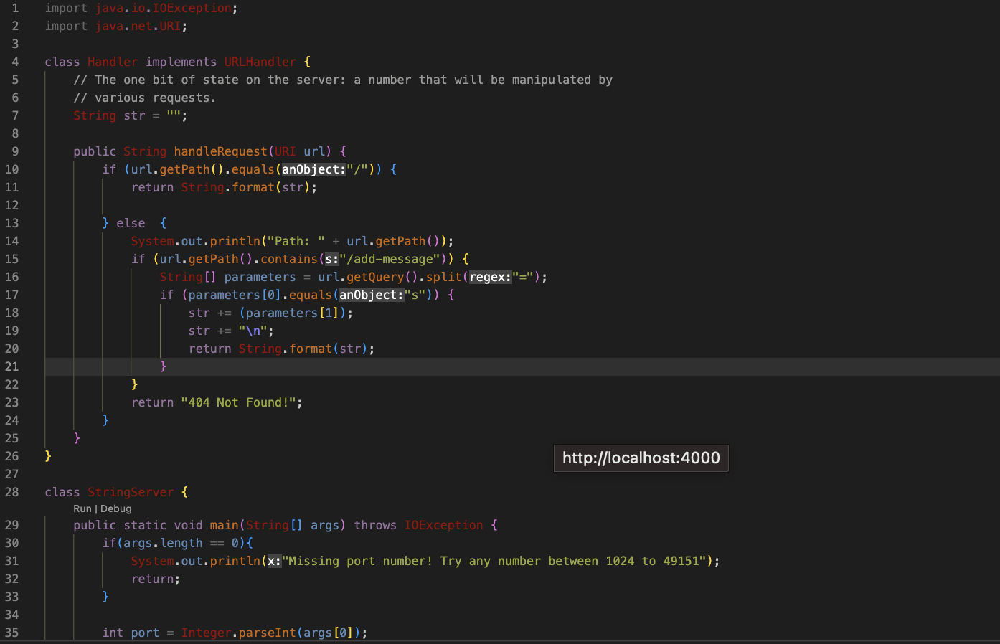
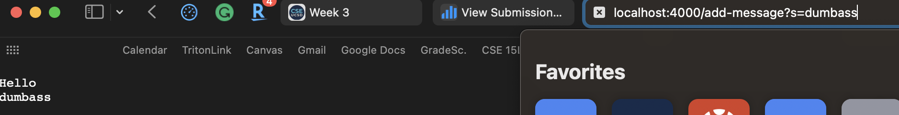

***PART 1:  /add-message ***

 {
    int[] input1 = {1,2,3};
    ArrayExamples.reverseInPlace(input1);
    assertArrayEquals(new int[]{3,2,1},input1);'

THE BEFORE AND AFTER CODE IS IN THE IMAGE ABOVE

***PART 3: LEARNING***
Something I learned this week in lab was how to use J-Unit tests. 
I learned how to format a J-Unit test and how to write tests to make sure I can debug my code properly. 
This is extremely helpful because it shows a different way to debug code.  
I also learned the difference between these j-unit tests than the tests we wrote in cse 8b class.
