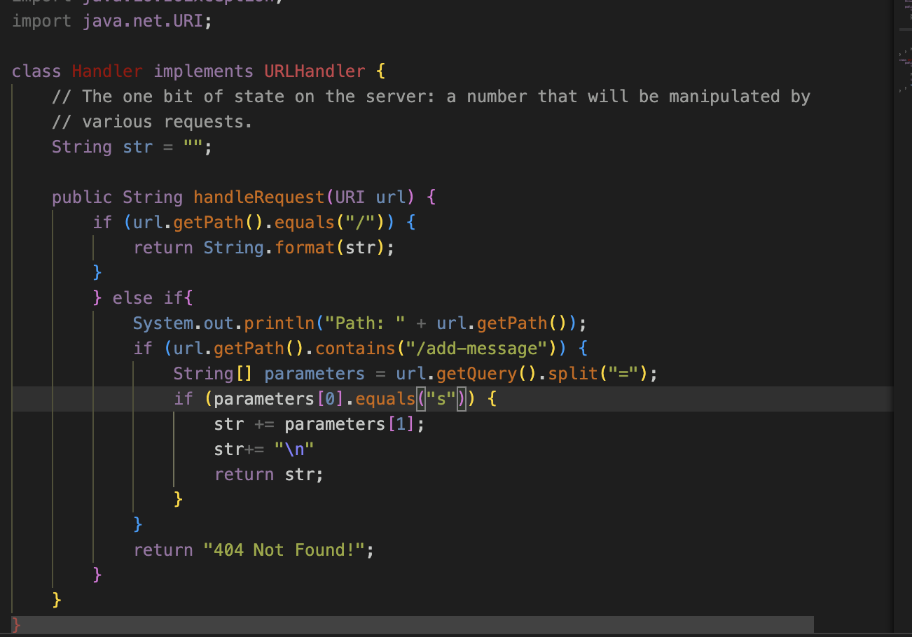
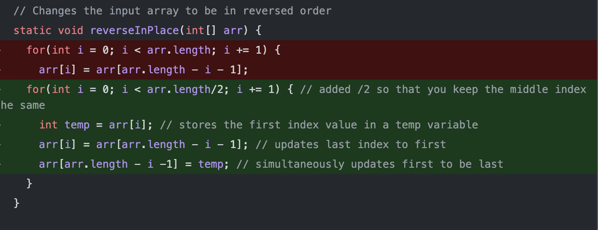

!!! I COULDN'T GET THE SERVER TO LOAD NOR COULD I COMPLILE THE FILE IM NOT SURE!!!

The handlerequest method is called as well as the main method under the main class StringServer.\

The relevant arguments would be the  "/add-message?s=Hello" because the handlerequest method using this to determine what to add to the empty string. 

No values got changed as the code doesn't affect the type of the fields in the class. 

@Test
  public void testReverseInPlace2() {
    int[] input1 = {1,2,3};
    ArrayExamples.reverseInPlace(input1);
    assertArrayEquals(new int[]{3,2,1},input1);

Something I learned this week in lab was how to use J-Unit tests. 
I learned how to format a J-Unit test and how to write tests to make sure I can debug my code properly. 
This is extremely helpful because it shows a different way to debug code.  
I also learned the difference between these j-unit tests than the tests we wrote in cse 8b.
