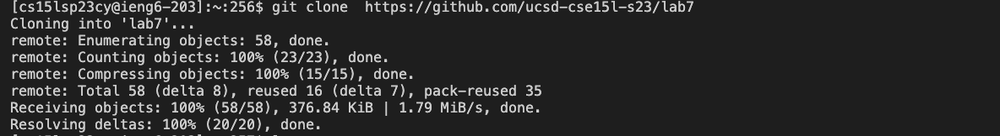
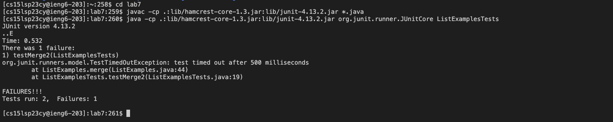
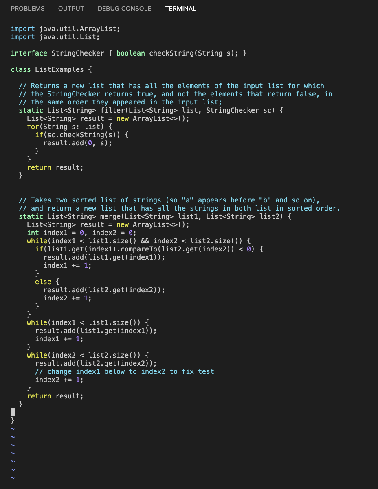
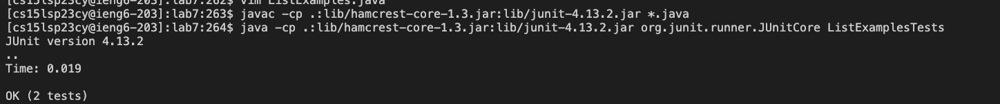
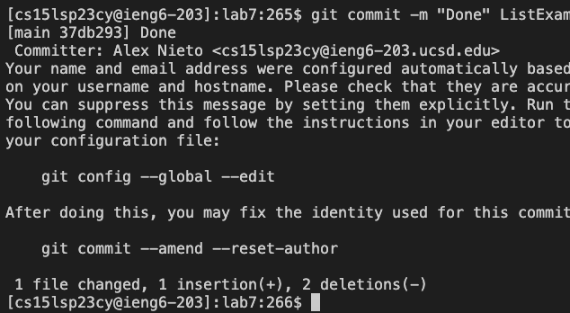

Step 1: Logging into ieng6

They keys I pressed in order were: `ssh`, `< SPACE >` , `cs15lsp23cy`, `< SHIFT 2 >` , `ucsd.edu`, `< ENTER >`.

I then entered my password, which I will not discuss the keys I pressed for OBVIOUS reasons. 

With these keys and steps I am able to log into my ieng6 account where I can then clone the repository. 

Step 2: Clone your fork of the repository from your Github account

 

The keys I pressed in order were: `git`, `< SPACE >` , `clone`, `< SPACE > `, `< CTRL V >`, `< ENTER >`.

With these keys, I am able to clone the link, which in turn let me have the file lab7 on my computer, which contains the two java files I need. 

I used `< CTRL V >` above because I had already had the link copied to my clipboard beforehand. 

Step 3: Run the tests, demonstrating that they fail

The keys I pressed in order were: `cd`, `< SPACE >`, `lab7`, `< ENTER >`, `< up >`, `< up >`, `< up >`, `< ENTER >`, `< up >`, `< up >`, 
`< ENTER >`.

With the keys, `cd`,` < SPACE >`, `lab7`, I was able to access the lab7 file and also access the `ListExamplesTests` file I needed to run.
`< up >`, `< up >`, `< up >`, `< ENTER >` was pressed because the ` javac -cp .:lib/hamcrest-core-1.3.jar:lib/junit-4.13.2.jar *.java` command was 3 up in the search history, so I used the up arrow to access it. Then, the `java -cp .:lib/hamcrest-core-1.3.jar:lib/junit-4.13.2.jar org.junit.runner.JUnitCore ListExamplesTests` was accessed in the same way by using the up keys and the hitting enter. These keys will then run the tests and see that they failed. 

Step 4: Edit the code file to fix the failing test

 

The keys I pressed in order were: `vim`, `< SHIFT > l`, `ist`, `< SHIFT > e`, `xamples.java`, `< ENTER >`, `/index1`, `< ENTER >`, `< n >` x10, `i`, `< RIGHT ARROW > x6`, `< BACKSPACE >`, `2`, `< ESC >`, `:wq`, ` < ENTER >`.

With these keys, I am able to open the java file to edit with vim and search for index1 using `/index1`, and edit the `index1` to `index2` as needed. After editing what was needed, I escaped vim by pressing the `< ESC >` button and then following that up with `:wq` which is used to save the edits made and exit the file simultaneously. 

Step 5: Run the tests, demonstrating that they now succeed

The keys I pressed in order were: `< up >`, `< up >`, ` < up > `, ` < up >`, `< ENTER >`, `< up >`, `< up >`, ` < up >`, `< ENTER >`

With these keys, I was able to run the tests again to make sure that they both passed. Since ` javac -cp .:lib/hamcrest-core-1.3.jar:lib/junit-4.13.2.jar *.java` was 4 up in my terminal command history, I pressed the `< up >` button 4 times and then hit `< ENTER >`. Since `java -cp .:lib/hamcrest-core-1.3.jar:lib/junit-4.13.2.jar org.junit.runner.JUnitCore ListExamplesTests` was 3 up in my terminal command history, I hit the `< up >` button 3 times and then hit `< ENTER >`.

Step 6: Commit and push the resulting change to your Github account (you can pick any commit message!)

The keys I pressed in order were: `git`, `< SPACE >`, `commit`, `< SPACE >`, `-m`, `< SHIFT >`, Done, `< SHIFT > l`, `ist`, `< SHIFT > e`, `xamples.java`, `< ENTER >`

With these keys, I was able to commit the edited and fixed/correct java file to my GitHub account with the "Done" message printed. 
