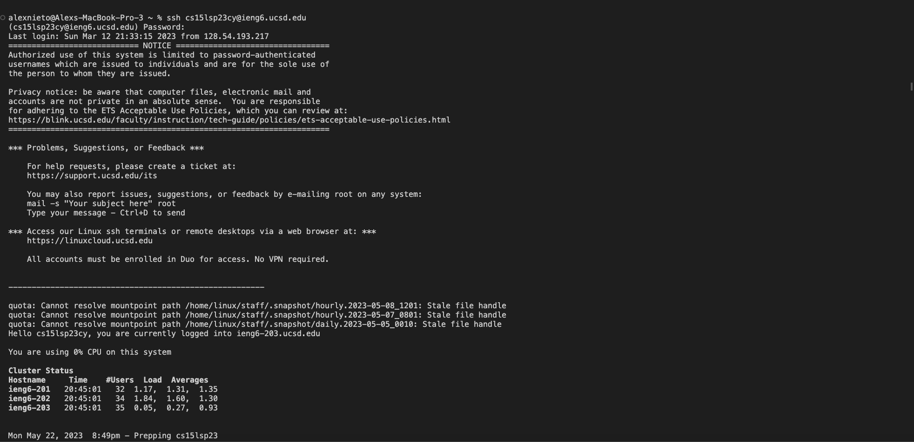
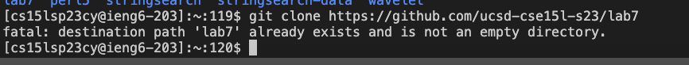

Step 1: Logging into ieng6

They keys I pressed in order were: 'ssh', SPACE, 'cs15lsp23cy', SHIFT 2, 'ucsd.edu', ENTER

I then entered my password, whic I will not discuss the keys I pressed for OBVIOUS reasons. 

With these keys and steps I am able to log into my ieng6 account where I can then clone the repository. 

Step 2: Clone your fork of the repository from your Github account

The keys I pressed in order were: 'git', SPACE, 'clone', <link>.

With these keys, I am able to clone the link, which in turn let me have the file lab7 on my computer, which contains the two java files I need. 

Step 3: 

