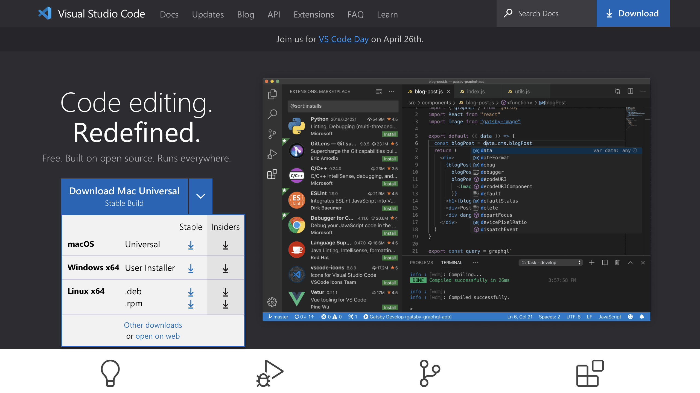

Hello! Here's a guide on how to: one) download VSCode; two) remotely connect; three) try some commands

Step 1: Downloading VSCode

Follow this link below:
https://code.visualstudio.com

Follow the instructions on screen and download the option best suited for you computer/software

