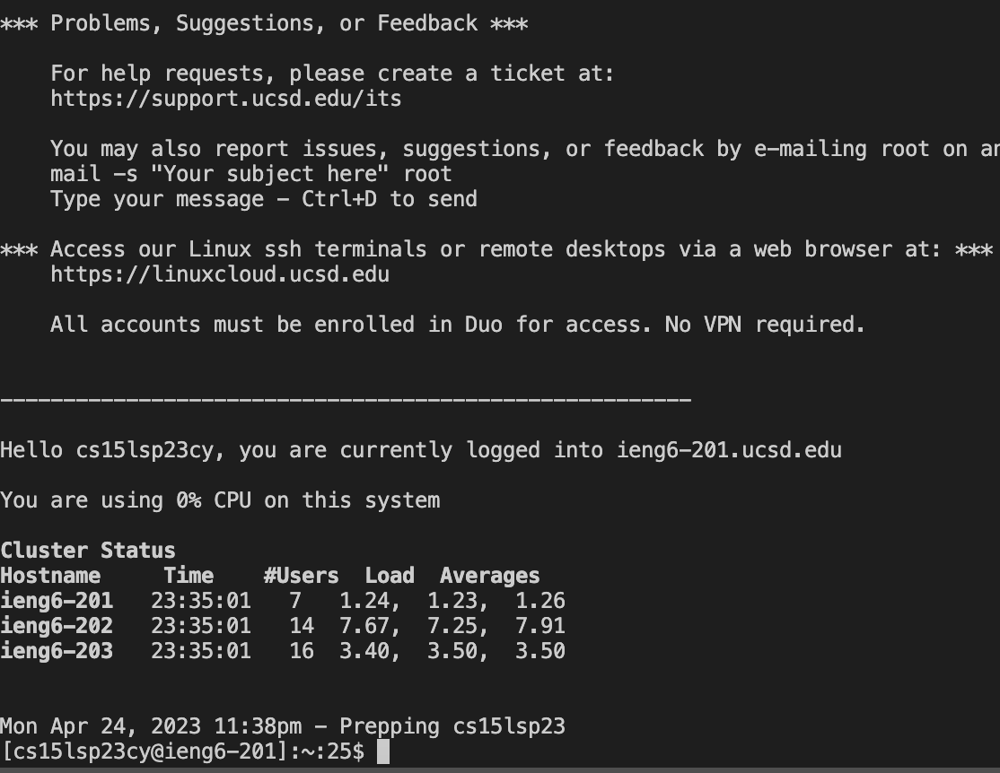
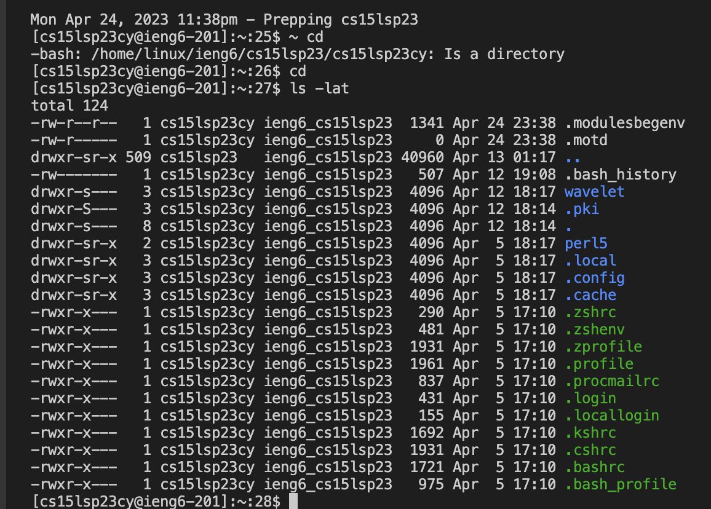

Hello! Here's a guide on how to: one) download VSCode; two) remotely connect; three) try some commands

Step 1: Downloading VSCode

Follow this link below:
[VSC](https://code.visualstudio.com)

Follow the instructions on screen and download the option best suited for you computer/software!

Once dowloaded, your screen should look something similar to the following picture. 

Step 2: Remotely Connecting

Open a java terminal in VSCode which can be done by opening a new java file, selecting Terminal command at the top of your screen, and seeing a terminal like the one pictured below:

You can find your CSE15L specific account here: [CSE15L Account] (https://sdacs.ucsd.edu/~icc/index.php)

To reset account follow this link: [Resetting Account Password/Account]([TUTORIAL](How to Reset your CSE 15L Password)

Next to the % sign type the following `ssh cs15lsp23zz@ieng6.ucsd.edu` - where zz is the unique characters assigned to your CSE15L account.

Considering this is the first time you will be logging in you may get a message similar to:

The authenticity of host 'ieng6.ucsd.edu (128.54.70.227)' can't be established.
RSA key fingerprint is SHA256:ksruYwhnYH+sySHnHAtLUHngrPEyZTDl/1x99wUQcec.
Are you sure you want to continue connecting (yes/no/[fingerprint])? 

You should say YES to tha above message!

You will then be prompted to enter your password for the account `cs15lsp23zz@ieng6.ucsd.edu`! Enter you password of course!

If not prompted for the password again, you should be now remotely connected as see something similar to:

Hello cs15lsp23zz, you are currently logged into ieng6-203.ucsd.edu

You are using 0% CPU on this system

Cluster Status 
Hostname     Time    #Users  Load  Averages  
ieng6-201   17:50:01   32  0.09,  0.32,  0.37
ieng6-202   17:50:01   30  0.08,  0.26,  0.35
ieng6-203   17:50:01   33  0.32,  0.58,  0.57

 
Wed Apr 05, 2023  5:52pm - Prepping cs15lsp23

Step 3: Trying Commands

To try commands 

`cd ~`
`cd`
`ls -lat`
`ls -a`
`ls <directory> where <directory> is /home/linux/ieng6/cs15lsp23/cs15lsp23abc, where the abc is one of the other group members’ username`
`cp /home/linux/ieng6/cs15lsp23/public/hello.txt ~/`
`cat /home/linux/ieng6/cs15lsp23/public/hello.txt`

After the $ sign, type a command and press enter! You will either see something like what's pictured above or it will ask for another command because the previous one was invalid!

And there you go you have downloaded VSC, connected remotely, and ran a command for the first time! Hope this helped!

