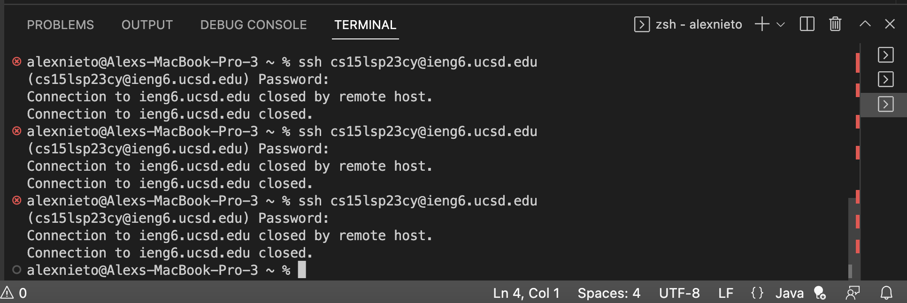

Hello! Here's a guide on how to: one) download VSCode; two) remotely connect; three) try some commands

Step 1: Downloading VSCode

Follow this link below:
https://code.visualstudio.com

Follow the instructions on screen and download the option best suited for you computer/software!

Once dowloaded, your screen should look something similar to the following picture. 

Step 2: Remotely Connecting

Open a java terminal in VSCode which can be done by opening a new java file, selecting Terminal command at the top of your screen, and seeing a terminal like the one pictured below:

Next to the % sign type the following - ssh cs15lsp23zz@ieng6.ucsd.edu - where zz is the unique characters assigned to your CSE15L account.

Considering this is the first time you will be logging in you may get a message similar to:

