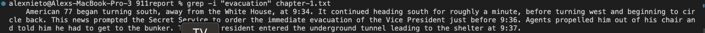

I will be choosing the grep command and researching unique ways to do some interesting command-line arguments. 

1. The  `grep -i` option

In the command line, we combine `grep` with `-i` alongside a string pattern in quotes such as `"evacuation"` and lastly the text file we want grep to look in, here `chapter-1.txt`.

The format for this command is `grep -i [string pattern to search] [text file name].txt`.

The `-i` option combined with 'grep' allows us to conduct a case-insensitive search for the string inputted, making grep ignore the case of the letter in the string pattern
The `-i` option also lets you find the string imbedded in another word, i.e. "no" in "nonsense". 

Source: ChatGPT.

2. The `grep -r` option

***More information under but couldn't fit in iamge***

In the command line, we combine 'grep' with `-r` alongside a string pattern in quotes such as `"civilians"` and lastly the name of a directory, such as `technical`.

The format of this command is `grep -r [string pattern to search] [name of directory]`.

The `-r` option combined with `grep` allows us recursively search for a string pattern in the files of a directory, as well as its subdirectories, as depicted above.
This can be checked as the name of the subdirectoires change and on the left is the lines of the subdirectories that matched the string pattern we argued. 

Source: ChatGPT. 

3. The `grep -v` option. 

***More information under but couldn't fit in iamge***

In the In the command line, we combine `grep` with `-v` alongside a string pattern in quotes such as `"the"` and lastly the text file we want grep to look in, here `chapter-1.txt`.

The format of this command is `grep -v [string pattern to search] [name of text file]`.

The `-v` option combined with 'grep' allows us to invert the search, as in look for all the lines in the text file that do not contain the string pattern argued.

Source: ChatGPT.

4. The `grep -c` option. 

In the In the command line, we combine `grep` with `-c` alongside a string pattern in quotes such as `"the"` and lastly the text file we want grep to look in, here `chapter-1.txt`.

The format of this command is `grep -c [string pattern to search] [name of text file]`.

The `-c` option combined with `grep` allows us to print the count/amount of lines in the text file argued that match/contain the string pattern, instead of printing all the lines. 

Source: ChatGPT.
